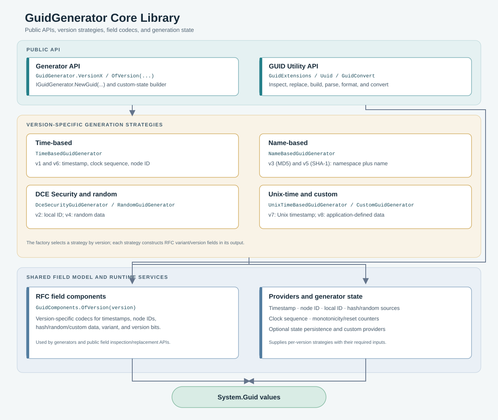

# Core Library Architecture

The diagram shows how the public API is separated from version-specific generation strategies and the shared field/state mechanisms.

## Read the Diagram

- **Generator API:** `GuidGenerator.VersionX` and `GuidGenerator.OfVersion(...)` select an `IGuidGenerator` strategy. Each strategy implements the algorithm and version-specific inputs for its GUID format.
- **GUID utility API:** `GuidExtensions`, `Uuid`, and conversion helpers operate on `System.Guid`. Field inspection and replacement use the component model directly; these operations do not need to create a generator.
- **Version strategies:** Time-based, name-based, DCE Security, random, Unix-time, and custom generators cover the supported layouts. For example, name-based generators hash a namespace and name, while time-based generators coordinate timestamp and node/sequence state.
- **Shared mechanisms:** `GuidComponents.OfVersion(...)` selects field layouts for encoding or decoding. Providers supply values such as timestamps, node IDs, or local IDs; state helpers support clock sequencing, monotonicity, pooling, and optional persistence where needed.

All generation and conversion APIs ultimately work with the .NET `System.Guid` value. The core library targets multiple frameworks; this site's API reference is generated from its Release `net10.0` assembly.

See the [API reference](xref:XNetEx.Guids.Generators.GuidGenerator) for the public generator contracts and the [Getting Started](getting-started.md) guide for usage examples.
